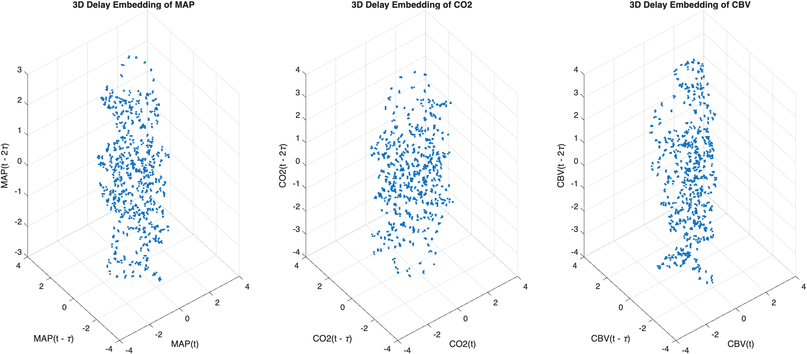
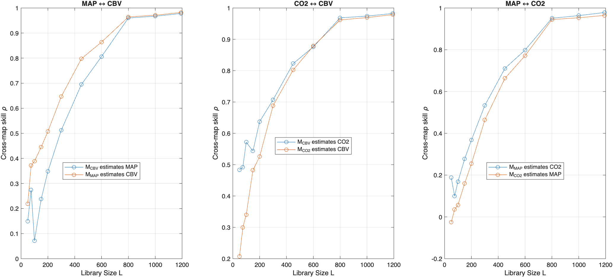
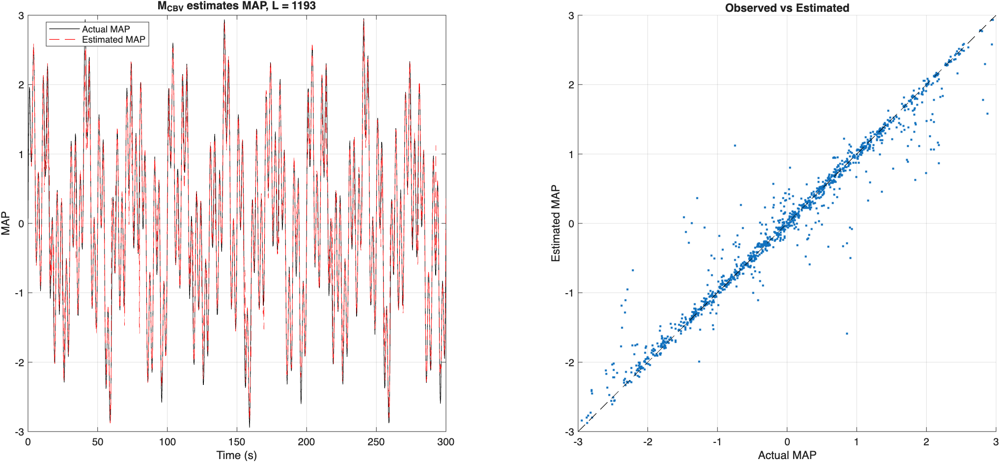
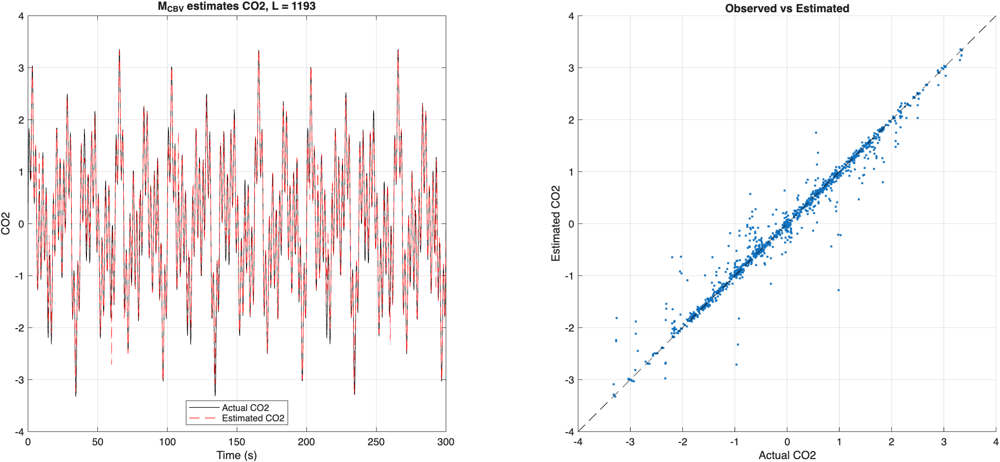

# Cerebral Hemodynamics CCM Analysis

This project implements **Convergent Cross Mapping (CCM)** for cerebrovascular signal analysis. The goal is to test whether reconstructed state spaces from one physiological signal can estimate another signal, which may suggest nonlinear dynamical coupling.

The current application focuses on three signals:

- **MAP**: mean arterial pressure
- **CO2**: end-tidal or respiratory carbon dioxide signal
- **CBV/CBFV**: cerebral blood velocity / cerebral blood flow velocity signal

This project is related to a larger MISO transfer function analysis pipeline. The MISO TFA pipeline estimates frequency-specific linear relationships between MAP, CO2, and CBV. The CCM pipeline provides a complementary time-domain/state-space approach for testing whether one signal contains dynamical information about another.

## Main Workflow

The analysis follows these steps:

1. Load or generate MAP, CO2, and CBV signals.
2. Build delay embeddings for each signal.
3. Visualize the reconstructed embeddings.
4. Run pairwise CCM cross-predictions.
5. Plot convergence curves across library sizes.
6. Plot diagnostic observed-vs-estimated comparisons.

The full analysis is run from:

```matlab
main
```

At the top of `main.m`, the project path is initialized using:

```matlab
addpath(genpath(project_root));
rehash
```

This gives MATLAB access to the analysis, plotting, data loading, and signal generation functions stored in subfolders.

## Delay Embedding

Each signal is converted into a delay embedding matrix. For a signal `x`, embedding dimension `e`, and delay `tau`, each valid row has the form:

```text
[x(t), x(t - tau), x(t - 2tau), ...]
```

The first valid embedding row is:

```matlab
firstEmbeddingIndex = 1 + (e - 1) * tau;
```

Rows before this index are invalid because there is not enough past signal history to build a full embedding vector.



## CCM Interpretation

CCM uses the reconstructed manifold from one signal to estimate another signal.

For example:

```text
M_CBV estimates MAP
```

means that the CBV embedding is used to estimate MAP.

The CCM interpretation is directionally "backwards":

```text
If MAP influences CBV, then the CBV manifold may contain information about MAP.
```

So for the physiological hypothesis:

```text
MAP -> CBV
CO2 -> CBV
```

the important CCM tests are:

```text
M_CBV estimates MAP
M_CBV estimates CO2
```

The reverse directions are still useful as comparison checks:

```text
M_MAP estimates CBV
M_CO2 estimates CBV
```

The MAP-CO2 pair is also tested because MAP and CO2 may be dynamically related or share common physiological drivers.

## Pairwise CCM Tests

The current pipeline runs six pairwise CCM predictions:

```text
M_CBV estimates MAP
M_CBV estimates CO2

M_MAP estimates CBV
M_CO2 estimates CBV

M_MAP estimates CO2
M_CO2 estimates MAP
```

These are stored inside the `ccmResults` structure. The top-level structure also stores the tested library sizes:

```matlab
ccmResults.EmbeddingSizes
```

Each pairwise result stores the trial correlations, average cross-map skill, estimated signals, and diagnostic data used for plotting.

## Library Size and Convergence

CCM is evaluated across multiple library sizes:

```matlab
EmbeddingSizes = [50 75 100 150 200 300 450 600 800 1000 maxEmbeddingSize];
```

For each library size `L`, the algorithm:

1. Randomly selects a valid library segment of length `L`.
2. Finds nearest neighbors in the source embedding.
3. Uses those neighbors to estimate the target signal.
4. Computes cross-map skill:

```text
rho = corr(actual target signal, estimated target signal)
```

The main CCM result is the convergence curve:

```text
rho vs library size L
```

A stronger CCM relationship is suggested when cross-map skill increases with library size and reaches a plateau.



## Diagnostic Observed-vs-Estimated Plots

The diagnostic plots show how well the CCM estimate reconstructs the target signal at a selected library size, usually the largest `L`.

These plots are useful because a high cross-map skill should correspond to a reasonable estimated time series, not just a favorable summary statistic.





## Relationship to MISO TFA

The MISO transfer function pipeline asks:

```text
At each frequency, how much of CBV is linearly explained by MAP and CO2?
```

The CCM pipeline asks:

```text
Does the reconstructed state space of one signal contain information about another signal?
```

So the two methods are complementary:

```text
MISO TFA:
    frequency-domain
    linear
    gain, phase, coherence

CCM:
    time-domain / state-space
    nonlinear dynamical coupling
    convergence of cross-map skill
```

Together, they may provide a broader view of MAP, CO2, and CBV interactions.

## Project Structure

```text
.
├── main.m
├── README.md
├── data/
├── figures/
│   ├── 3D_Delay_Embedding_Plots.png
│   ├── Cross-map_Correlations.png
│   ├── ActualvsEstimated_MAP.png
│   └── ActualvsEstimated_CO2.png
└── src/
    ├── additional_helpers/
    ├── ccm/
    ├── data_loaders/
    ├── embeddings/
    ├── plotting/
    └── signal_generators/
```

The current default workflow uses a synthetic Sho-inspired MISO signal generator in `src/signal_generators/`. The project also includes an Excel loader in `src/data_loaders/` for bringing in MAP, CO2, and CBV/CBFV recordings from external data files.

## Current Limitations

This pipeline is still in development. Current limitations include:

- Pairwise CCM can be affected by shared physiological drivers.
- High cross-map skill alone does not prove direct causality.
- Surrogate testing has not yet been added.
- Embedding dimension and delay selection are currently user-defined.
- Results should be interpreted alongside physiological knowledge and MISO TFA results.

## Planned Next Steps

Possible future improvements:

1. Add surrogate testing using shuffled or phase-randomized signals.
2. Add automatic embedding dimension and delay selection.
3. Add summary tables for final cross-map skill and convergence strength.
4. Compare CCM results between simulated and real physiological data.
5. Integrate CCM outputs with existing MISO TFA reports.
